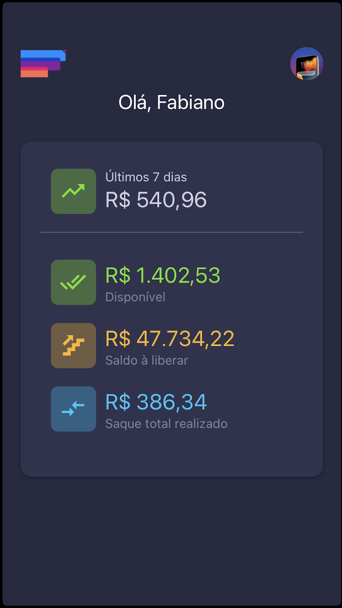
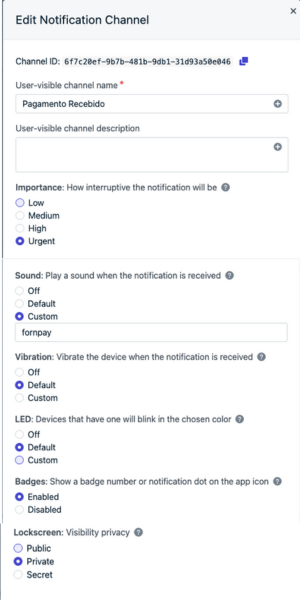

# UnicoPag App

<br />
<div class="row">

  <div style="width: 50%; float:left; margin-right:20%">
Este é o App da UnicoPag, projeto que foi criado com React Native CLI 0.76

### 💻 As tecnologias utilizadas neste APP:

    - React Native CLI;
    - Typescript;
    - Styled-Components;
    - Zustand
    - React Native Chart Kit;
    - React Query
    - One Signal

  </div>
  <div class="column" style="margin-left: 30px">
  

  </div>
</div>

<br />

## ⚒️ Pré-Instalação

```
É necessário criar 2 arquivos com as keys na raiz do projeto, o arquivo .env e .env.production.

As chaves estão no arquivo .env-public
Os valores de cada chave está com o responsável do projeto.

```

<br />
<br />

## ⚒️ Instalação

Para instalar abra o terminal do seu computador, navegue até a pasta raiz do projeto e digite:

```

npx install

ou

yarn

```

👨🏾‍💻 Após a instalação das dependências, ios precisa instalar o pods. No terminal execute o seguinte comando:

```

> cd ios && pod install && cd ..

```

📱 Após a instalação das dependências, escolha a plataforma e rode o seguinte comando:

```

> npm android (yarn android)

ou

> npm ios (yarn ios)

```

<br />
<br />

## ⚒️ OneSignal - Mensagem via plataforma

📱 Para utilizar corretamente a notificação, o OneSignal Precisa dessas configurações abaixo:

```
Android Channel:

> Projeto OneSignal
-> Settings
-> Messaging
-> Android Notification Channels
-> Add Group
-> Add Channel
```



<br />

#### ⚒️ Configuração Notificação:

É necessário ficar conforme as configurações abaixo. Caso utilize via request, tem que adicionar os nomes do audio, icone e channel configs para que funcione, conforme a documentação:

-> [Create Notification](https://documentation.onesignal.com/reference/create-notification)

-> [ID Channel](https://dashboard.onesignal.com/apps/b3735b6c-0828-47cf-adeb-368574514b33/settings/messaging)

<br />
<br />

## ⚒️ OneSignal - Mensagem via rest api

📱 Para utilizar corretamente a notificação via api é necessário seguir o seguinte json no body da request (mensagem individual, filtrando por email):

```
post: https://onesignal.com/api/v1/notifications

[{"key":"Accept","value":"application/json","description":"","type":"text","enabled":true},{"key":"Content-Type","value":"application/json","description":"","type":"text","enabled":true},{"key":"Authorization","value":"Basic [Rest API Key PEGA AQUI -> https://dashboard.onesignal.com/apps/26ec6999-c8cb-4be3-9205-b68d7ed0691b/settings/keys_and_ids]","description":"","type":"text","enabled":true}]

{
	"filters": [
		{
			"field": "tag",
			"key": "email",
			"relation": "=",
			"value": "email@email.com"
		}
	],
	"app_id": "app_id_voce_pega_na_plataforma",
 	"headings": { "en": "Titulo da mensagem", "pt": "Titulo da mensagem em portugues" },
	"contents": { "en": "Descricao da mensagem", "pt": "Descricao da mensagem em portugues" },
	"ios_sound": "unicopag.wav",
	"android_channel_id": "ID DO CHANNEL",
	"large_icon": "icon_notification",
	"small_icon": "icon_notification",
  "accent_color": "0C0C18"
}

OBS: para o som de caixa registradora é obrigatorio colocar no ios a flag "ios_sound".
OBS2: para o funcionamento correto do android, é necessário ter o android_channel_id (para pegar o id, basta copiar o id da criação do canal conforme citado la em cima no print),  large_icon e small_icon: "ic_notification".
```

<br />
<br />

## ⚒️ Lojas AppStore e PlayStore

#### Android

📱 O arquivo para gerar a build está dentro da pasta android/app, sem a extensão .jsk, então quando for gerar, basta adicionar a extensão (unicopagjks para unicopag.jks e caso precise da private key, so mudara para private_key.pepk). As credencias estão dentro do arquivo gradle.properties

#### IOs

📱 Para subir uma nova versão é preciso logar com a conta fbinformatica.info@gmail.com no xcode e seguir o procedimento normal da apple.
